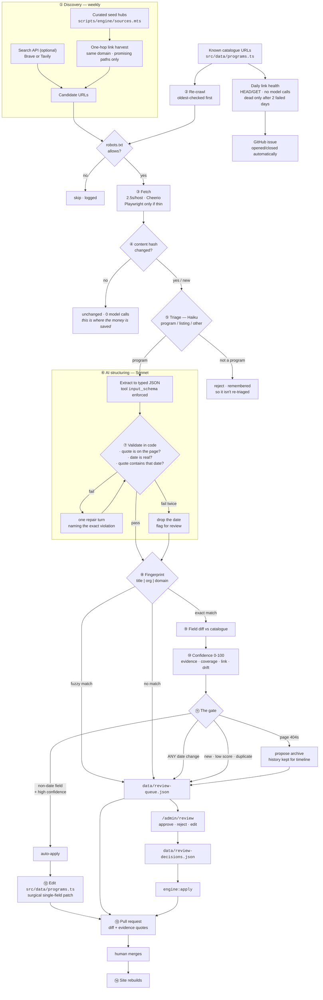

# The "Always-Updated" Data Engine

How program data gets in, stays current, and never claims more certainty than it has.

- [1. What it does, and what it refuses to do](#1-what-it-does-and-what-it-refuses-to-do)
- [2. Architecture](#2-architecture)
- [3. Discovery](#3-discovery)
- [4. Extraction and the prompts](#4-extraction-and-the-prompts)
- [5. Deduplication](#5-deduplication)
- [6. Confidence and the auto-publish gate](#6-confidence-and-the-auto-publish-gate)
- [7. Verification, dead links and expiry](#7-verification-dead-links-and-expiry)
- [8. The review queue](#8-the-review-queue)
- [9. Setup and API keys](#9-setup-and-api-keys)
- [10. Cost](#10-cost)
- [11. Running it, and what it cannot do yet](#11-running-it-and-what-it-cannot-do-yet)

---

## 1. What it does, and what it refuses to do

**Does:** finds programs nobody typed in, re-checks the ones already listed, notices when a
deadline moves, notices when a page dies, and proposes all of it as a pull request.

**Refuses:** publishing a date no human has seen.

That second point is the design constraint everything else bends around, so it is worth saying
plainly. A directory of student opportunities has exactly one way to seriously hurt somebody: tell
them an application closes on the 15th when it closed on the 1st. Every other failure — a missing
listing, a stale cost, an ugly summary — is recoverable by the student. A wrong deadline is not.

So the gate is asymmetric on purpose:

| Change                                                                            | Who approves it                                                |
| --------------------------------------------------------------------------------- | -------------------------------------------------------------- |
| Summary, category, cost note, format, eligibility, required documents, apply link | The engine, at high confidence                                 |
| **Any of the four dates**                                                         | **A person. Always. At any confidence score.**                 |
| A brand-new listing                                                               | A person, once. After that its prose fields drift on their own |
| Archiving a dead listing                                                          | A person                                                       |

An engine that "usually" gets dates right is not good enough, because the failure is silent: nobody
notices a wrong deadline until a student misses it.

---

## 2. Architecture



### The cadences

| Job           | When             | Model calls | What it does                   |
| ------------- | ---------------- | ----------- | ------------------------------ |
| `link-health` | daily 11:00 UTC  | none        | HEAD/GET every listing link    |
| `crawl`       | Monday 12:00 UTC | ~40–80      | Re-verify + discover           |
| `apply`       | on demand        | none        | Write what a reviewer approved |

### The files

```
scripts/engine/
  types.mts        Shared types. `Evidence` is the trust model in one union.
  sources.mts      Seed hubs, denylists, URL canonicalisation, registrable domain.
  fetch.mts        robots.txt, rate limiting, readable text, content hashing.
  discover.mts     Hub crawl (one hop) + optional search API.
  prompts.mts      The exact system prompts. Diff these on their own.
  extract.mts      Tool-schema extraction, validation, repair loop.
  dedupe.mts       Fingerprint + fuzzy second pass.
  confidence.mts   Scoring and the auto-publish gate.
  linkcheck.mts    Daily health with two-strike dead detection.
  catalog.mts      Brace-aware surgical editor for programs.ts.
  sink-git.mts     Auto-apply, review queue, decisions, PR body.
  run.mts          Orchestrator CLI.
  apply.mts        Applies reviewer decisions.
  check-extract.mts 68 offline assertions. No key, no network, no cost.

supabase/migrations/0001_data_engine.sql   Shipped, not wired up. See §11.
.github/workflows/sync-programs.yml        The three jobs above.
src/routes/admin.review.tsx                The queue UI.
data/                                      crawl-state · link-health · review-queue · engine-report
```

---

## 3. Discovery

Two channels, both of which respect the terms of the services involved:

**Seeded hub crawl.** A curated list of pages that _list_ programs — university outreach offices,
competition bodies, provincial job pages, non-profits — followed exactly **one hop**. No recursion.
A recursive crawler pointed at a university domain will cheerfully download forty thousand course
pages and bill you for reading them.

**A search API.** Brave Search or Tavily, both with usable free tiers, both of which permit
programmatic queries. Optional — with no key configured the engine runs on hubs alone and says so
in the log.

**Not** scraping Google or Bing result pages. That breaches their terms of service, and an engine
that starts by breaching terms is not one you can put in front of a school board.

### Before your first run

The seed list in `sources.mts` is a **starting point written from general knowledge**, not a verified
manifest — I could not reach these pages from where the engine was built. Run this first:

```bash
npm run engine:seeds
```

It fetches every seed, reports which are alive and which robots.txt refuses, and exits non-zero if
any are dead. Delete what is dead, add the hubs you actually care about, and the list becomes yours.
Ten good hubs beat fifty aspirational ones.

> **Catalogue gap worth aiming at:** Trades has one listing against Leadership's 29. `skills-ontario`
> is in the seed list for exactly that reason. Trade programs are under-listed everywhere, which is
> part of why students don't find them.

---

## 4. Extraction and the prompts

The full text lives in [`scripts/engine/prompts.mts`](../scripts/engine/prompts.mts). Two prompts:

**`TRIAGE_SYSTEM`** — runs on Haiku, classifies `program | listing | other`, and exists purely so the
expensive model never sees a staff directory. A page classified `other` is remembered, so it is not
re-triaged next week.

**`EXTRACT_SYSTEM`** — the real one. Its opening line does the heavy lifting:

> You are a TRANSCRIBER, not a researcher. Your only source of truth is the page text given to you in
> this conversation. You have no other knowledge of this program, and any memory you may have of it
> is unreliable and must be ignored.

The single biggest failure mode for this task is a model that helpfully supplies the deadline it
remembers from training. Every rule in the prompt exists to make that feel wrong.

### The mechanism that actually stops hallucination

Prompting alone is not a guarantee. The guarantee is structural: **every date must come back with a
verbatim quote, and `validate()` checks in code that the quote really is on the page.**

A model that invents a date has to invent a quote to carry it, and a substring check catches that
deterministically, every time, for free. Three layers:

1. `input_schema` on the tool constrains shape and enum values at generation time.
2. `validate()` re-checks: the quote appears in the page text (whitespace-insensitive); the date is a
   real calendar date within a sane year range; and **the quote actually contains the date it claims
   to support** — which catches a real quote paired with the wrong date.
3. One repair turn naming the exact violation. Fail twice and the date is dropped, not published,
   and the item goes to review with a note.

`check-extract.mts` asserts all of this, including the specific adversarial cases: a fabricated
deadline, a real quote with a shifted date, an impossible calendar date, and a date the model
itself marked `inferred`.

### Evidence levels

| Level        | Meaning                                                     | Site confidence       |
| ------------ | ----------------------------------------------------------- | --------------------- |
| `structured` | schema.org JSON-LD or `<time datetime>`                     | may be **confirmed**  |
| `labelled`   | page names the field: "Application deadline: March 1, 2027" | may be **confirmed**  |
| `prose`      | read out of a running sentence                              | **estimated** at best |
| `inferred`   | the model worked it out                                     | dropped entirely      |

These map onto the `confirmed | estimated | unposted` vocabulary `src/lib/program-schema.ts` already
speaks, so the UI needs no changes to display them honestly.

---

## 5. Deduplication

The primary key is the fingerprint the spec asks for:

```
normalize(title) | normalize(organization) | registrableDomain(url)
```

`normalize` lowercases, strips accents, drops edition noise (`23rd`, `2027`, `Annual`, `Summer`,
`Program`) and institutional filler (`University`, `Faculty`, `of`), then **sorts the remaining
words** — so "Summer Engineering Academy" and "Engineering Academy (Summer 2027)" fingerprint
identically, and a move from `www.` to `apply.` on the same registrable domain does not create a
second listing.

Renames defeat any strict key, so there is a soft second pass: same domain (or ~identical
organisation) plus high title similarity flags a **probable** duplicate — which goes to a human. It
never merges on its own. A wrongly merged pair silently hides a real program from students; a
duplicate is merely untidy and visible. Fail toward the visible one.

Title similarity is the stronger of bigram Dice and token containment, because Dice alone punishes
an appended qualifier ("… (Residential Stream)" scores only 0.67) and that is one of the commonest
ways a duplicate gets created.

---

## 6. Confidence and the auto-publish gate

Scored from signals the model cannot talk its way around — not from how sure it sounds:

| Signal                                     | Effect    |
| ------------------------------------------ | --------- |
| Evidence quality of the dates found        | up to +14 |
| Date coverage (how many of the four)       | up to +10 |
| Field completeness                         | up to +18 |
| Page returned 200                          | +5        |
| Application link resolves                  | +8        |
| Application link is dead                   | −25       |
| Page text under 800 chars                  | −15       |
| Needed JS rendering                        | −3        |
| Page text changed heavily since last crawl | −10       |
| Validation errors survived the repair turn | −12 each  |
| Model flagged 3+ ambiguities               | −6        |

Base is 42, so a page that does everything right lands in the mid-90s rather than pinning at 100 — a
saturated score cannot tell two good pages apart. Bands: **high ≥ 78**, **medium ≥ 55**, **low** below.

And then the gate, which is short:

```ts
export const NEVER_AUTO = new Set([
  "app_open_date",
  "app_deadline",
  "program_start_date",
  "program_end_date",
  "title",
  "is_active",
  "confidence",
]);
```

The SQL schema enforces the same rule independently — a trigger on `update_logs` raises if anything
tries to insert a date row as `auto-published`. Belt and braces: a future script with a bug should
not be able to quietly publish a deadline.

---

## 7. Verification, dead links and expiry

**Staleness.** The re-crawl processes oldest-checked first, so a run capped at 60 pages still makes
even progress across the catalogue rather than re-reading the same first sixty. `LIFECYCLE.staleAfterDays`
(45) is what the UI uses to hedge a listing it has not seen recently.

**Content hashing.** The hash is of _normalised visible text_, not raw HTML. Almost every site
changes its HTML daily — session ids, CSRF tokens, "12 people are viewing this". Hashing raw HTML
would call the LLM on every page every day, which is the entire cost of the pipeline, spent on
nothing. Unchanged text means zero model calls.

**Dead links.** One failure is never "dead". Sites go down, WAFs rate-limit bots, university IT does
maintenance on a Sunday. A link is marked dead only after failing on **two different days**, tracked
in `data/link-health.json`, which is committed — so you also get a free audit trail of every outage.
HEAD is tried first; 405/501/403 fall back to GET, because plenty of servers refuse HEAD and serve
GET fine.

**Expiry.** A 404 or 410 on a page we have seen before proposes `archive`, not delete. The listing
stays in the catalogue with its history intact so the timeline view can still show that this program
existed and when it ran — which is genuinely useful to a grade 10 student planning for grade 11. In
the SQL schema this is `state = 'archived'`, with `next-cycle` for a program expected to reopen.

---

## 8. The review queue

`/admin/review` reads `data/review-queue.json`. It is `noindex`, and it edits nothing itself — it
writes decisions, and `engine:apply` turns those into a diff.

Each card answers three questions above the fold: **what changed**, **what sentence on the source
page says so**, and **is the link alive**. Dates show the supporting quote as a blockquote with an
evidence chip, because "the page says March 1" and "we think it's March 1" are different claims and
the reviewer needs to see which one they are approving.

One click to approve or reject. Inline date editing for when the model got it nearly right.
Keyboard: `A` approve, `R` reject, `E` edit, `J`/`K` move, `U` undo — the queue should be clearable
in the four minutes between periods.

In dev, Save writes `data/review-decisions.json`. On a deployed build there is no writable
filesystem, so Save downloads the same file to commit. Then:

```bash
npm run engine:apply          # or the `apply` workflow in Actions
```

**A reviewer who never opens the app still works.** The pull request body contains every queued item,
its reasons, its field changes and its evidence quotes in collapsible sections. Reading the PR and
merging is a complete workflow.

---

## 9. Setup and API keys

### 9.1 Dependencies

```bash
npm i @anthropic-ai/sdk cheerio
npm i -D playwright
npx playwright install chromium     # local only; CI installs it in the workflow
```

Add to `package.json`:

```json
{
  "scripts": {
    "engine": "node --experimental-strip-types --import ./scripts/register-alias.mjs scripts/engine/run.mts",
    "engine:seeds": "npm run engine -- --mode=seeds",
    "engine:links": "npm run engine -- --mode=links",
    "engine:verify": "npm run engine -- --mode=verify",
    "engine:discover": "npm run engine -- --mode=discover",
    "engine:apply": "node --experimental-strip-types --import ./scripts/register-alias.mjs scripts/engine/apply.mts",
    "check:engine:data": "node --experimental-strip-types scripts/engine/check-extract.mts"
  }
}
```

Requires Node 22.18+ or 23+ for `--experimental-strip-types`. The existing `scripts/register-alias.mjs`
resolve hook is reused so `@/…` imports work outside Vite.

### 9.2 Anthropic — required

1. Go to <https://console.anthropic.com> → **API Keys** → **Create key**. Name it `apptrack-engine`.
2. Copy it once (it is not shown again).
3. Local: put it in `.env.local`, which is already gitignored.

   ```bash
   ANTHROPIC_API_KEY=sk-ant-...
   ```

4. CI: repo → **Settings** → **Secrets and variables** → **Actions** → **New repository secret**,
   named exactly `ANTHROPIC_API_KEY`.
5. Set a monthly spend limit in the console under **Billing → Usage limits**. Do this before the
   first scheduled run, not after. $10/month is generous for this workload.

Optional overrides: `ENGINE_MODEL` (default `claude-sonnet-4-5`), `ENGINE_TRIAGE_MODEL`
(default `claude-haiku-4-5`).

### 9.3 Search API — optional

Pick one; the engine prefers Brave if both are set.

**Brave Search** — <https://brave.com/search/api/>. The free tier allows 1 query/second and about
2,000 queries/month, which is far more than six queries a week needs. Dashboard → **Subscriptions** →
copy the token. Secret name: `BRAVE_SEARCH_API_KEY`.

**Tavily** — <https://tavily.com>. Free tier around 1,000 credits/month. Secret name: `TAVILY_API_KEY`.

With neither set, discovery is hub-only. That is a perfectly good configuration; hubs find the
programs that institutions actually publish, and search mostly finds the same ones again.

### 9.4 GitHub Actions

The workflow needs nothing beyond the repo's own token plus the secrets above, but PR creation must
be allowed:

**Settings → Actions → General → Workflow permissions:**

- Read and write permissions ✔
- Allow GitHub Actions to create and approve pull requests ✔

Create two labels so the automation can file things tidily: `data-engine` and `link-health`.

Schedules run in UTC. `0 11 * * *` is 07:00 ET in winter, 06:00 in summer — GitHub does not adjust
for DST, and scheduled runs can be delayed by several minutes under load. Neither matters here.

### 9.5 Supabase — optional, not wired up

Only needed if you move off the git sink (see §11). Create a project at <https://supabase.com>
(free tier is sufficient), then:

```bash
supabase link --project-ref <ref>
supabase db push          # applies supabase/migrations/0001_data_engine.sql
```

Secrets, if you go this route: `SUPABASE_URL`, `SUPABASE_SERVICE_ROLE_KEY` (server-side only — it
bypasses row-level security, so it must never reach the browser), and `SUPABASE_ANON_KEY` for the
public read path.

### 9.6 Never commit

`.env.local` is gitignored already. Sanity-check before the first push:

```bash
git check-ignore -v .env.local        # should print the rule that ignores it
```

---

## 10. Cost

Per weekly run, at the default `--limit=60`:

|                           |                                             |
| ------------------------- | ------------------------------------------- |
| Pages fetched             | ~60–100                                     |
| Unchanged (no model call) | typically 60–75% after the first few runs   |
| Triage calls (Haiku)      | ~25, ~12k tokens each                       |
| Extraction calls (Sonnet) | ~20, ~15k in / ~1.2k out                    |
| **Estimated**             | **$0.40–$1.20 per run, roughly $2–5/month** |

The run prints its actual token usage and a cost estimate, and the PR body carries it. If the number
surprises you, `--limit` is the dial, and the content hash is why the number falls after the first
few runs.

Daily link health costs nothing — no model calls at all. GitHub Actions minutes are free on public
repos; this uses roughly 20 minutes a week on a private one.

---

## 11. Running it, and what it cannot do yet

```bash
npm run check:engine:data     # 68 offline assertions. No key, no network, no cost.
npm run engine:seeds          # check the seed list is alive
npm run engine -- --mode=verify --limit=5 --dry-run    # smallest real run
npm run engine -- --mode=all --limit=60
```

`--dry-run` still writes the review queue and the report; it just never touches `programs.ts`.

### Said plainly

**The offline test suite passes — 68 assertions covering quote validation, the date gate, dedupe,
confidence scoring and the `programs.ts` editor. The SQL migration applies cleanly to a real
Postgres 16, twice, and its constraints and trigger were exercised.** Those I ran.

**I have not run a live crawl or a live extraction.** The environment this was built in cannot reach
arbitrary program URLs, and it has no Anthropic key. So:

- The seed URLs in `sources.mts` are unverified — `npm run engine:seeds` is the first thing to run.
- `EXTRACT_SYSTEM` has never been measured against a real page. `check-extract.mts --live` runs it
  against the bundled fixture and asserts the four dates, the grades and the bursary classification;
  that is the regression test, and it needs your key to execute.
- Expect the first real run to need prompt tuning. Budget an hour for it and keep `--limit` small.

### Known limits

- **Heavy renames come through as new listings.** "Academy" → "Institute" falls below the similarity
  floor. That is the safe direction to fail: a new listing still reaches a human, who can spot the
  duplicate. Merging on a guess would hide a real program.
- **The git sink stops scaling around 500 listings**, when the PR diff stops being readable. That is
  what the SQL migration is for; it is written, tested and deliberately not connected.
- **PDFs are skipped.** A lot of school board program information is a PDF. Adding `pdf-parse` to the
  ingestion layer is the single highest-value extension here.
- **Ambiguous numeric dates are dropped, not guessed.** `03/04/2027` is genuinely ambiguous between
  Canadian and US ordering, so it becomes null plus a note. This will annoy you. It is correct.
- **`SITE.contactEmail` is still `hello@ontariostudentopportunities.ca`**, a domain nobody owns. The
  crawler sends it in its User-Agent so site owners can contact you, which is the polite convention
  and currently a dead end. Worth fixing before the first real crawl.
